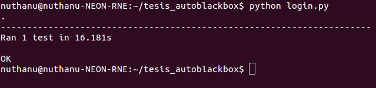

# Automated Black Box Testing Menggunakan Selenium Python Terhadap Website "Permohonan Paspor Online" Berbasis Web

## Intro

1. Download Selenium Python
Masukkan command <strong> pip install selenium </strong> pada terminal

2. Download driver browser
Pada pengujian ini menggunakan browser firefox dan dapat mendownloadnya melalui https://github.com/mozilla/geckodriver/releases

3. Letakkan geckodriver tadi ke dalam folder pengujian
4. Tambahkan path pengujian ke dalam .bashrc dengan mengetikkan command <strong> gedit ~/.bashrc </strong> pada terminal 

## Mengeksekusi Pengujian

1. Persiapkan file test case yang telah diterjemahkan ke bahasa pemrograman, dalam hal ini menggunakan bahasa python.
2. Buka terminal dan masuk ke dalam direktori folder pengujian.
3. Pilih salah satu file test case yang akan dilakukan pengujian dengan menggunakan command <strong> python (nama_file.py) </strong>, contoh: <strong> python login.py </strong>. Tunggu beberapa saat hingga muncul hasil berupa jumlah test case skenario yang diujikan dan lamanya waktu pengujian, seperti pada gambar di bawah ini:

